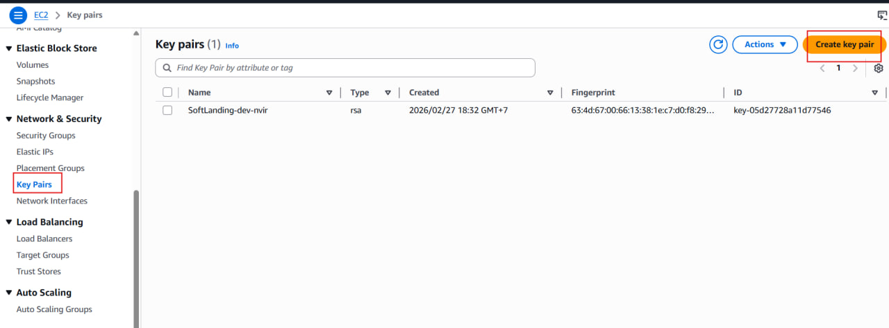
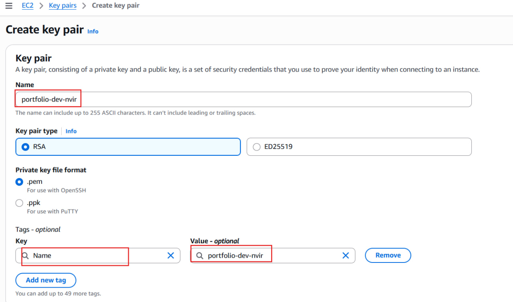
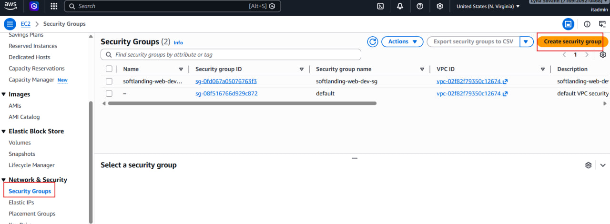
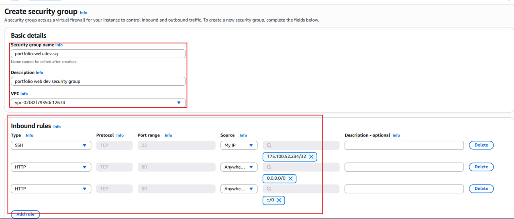
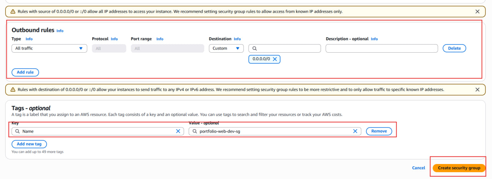
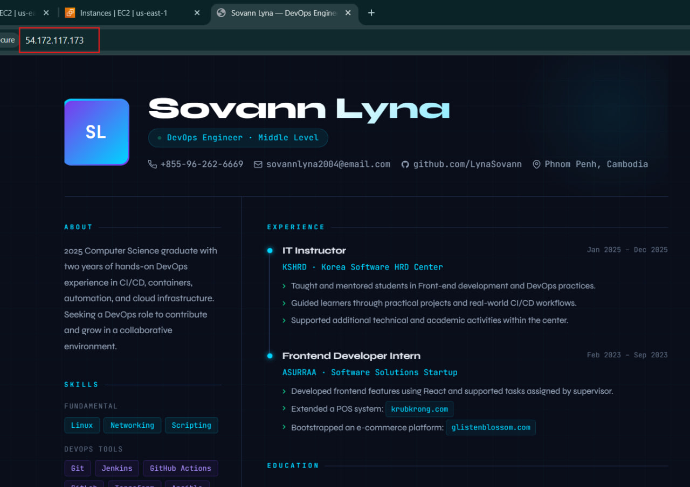

# devops-aws-ec2-labs (via AWS Console UI)

Hands-on **AWS EC2 labs** demonstrating infrastructure provisioning, automation, and production-style deployment practices using the AWS Management Console.

---

This lab walks through:

- Creating a Key Pair
- Configuring a Security Group
- Launching an EC2 Instance
- Using User Data for automation
- Verifying deployment

---

## What is Amazon EC2?

Amazon Elastic Compute Cloud (EC2) is a cloud service that provides resizable virtual servers (instances) in the cloud. It allows you to run applications without managingg physical hardware.

---

## Create a key pair

### What is a Key Pair?

A **Key Pair** consists of:

- **Public Key** → Stored in AWS
- **Private Key (.pem file)** → Downloaded and kept securely by you
  It is used for **secure SSH authentication** instead of passwords.

### Why do we need it when creating an EC2 instance?

When launching a Linux EC2 instance:

- AWS disables password authentication by default.
- You must use SSH key-based authentication.
- Without the private key, you cannot SSH into your instance.
  Example SSH command:

```bash
ssh -i my-key.pem ubuntu@<public-ip>
```

### How to crete a Key Pair (via AWS Console)

1. Login to **AWS Management Console**
2. Go to **EC2 Dashboard**
3. Click on Key Pairs
4. Click **Create Key Pair**
5. Configure:

- Name: ...
- Key pair type: ..
- Private key format: ...

6. Click **Create Key Pair**
7. Download and store the **.pem** file securely
   
   

---

## Security Group

### What is a Security Group?

A **Security Group** acts as a virtual firewall for your EC2 instance.
It controls:

- Inbound traffic (incoming)
- Outbound traffic (outgoing)

### Create a Security Group

1. Go to **EC2 Dashboard**
2. Click on Security Groups
3. Click Create Security Group

#### Configuration:

Name: ...
Description: ...
Inbound Rules:

| Type | Protocol | Port | Source    |
| ---- | -------- | ---- | --------- |
| SSH  | TCP      | 22   | My IP     |
| HTTP | TCP      | 80   | 0.0.0.0/0 |

Outbound: Leave default (Allow All)





---

## Create an EC2 Instance

1. Go to **EC2 Dashboard**
2. Click **Launch Instance**

User data

```bash
#!/bin/bash

sudo -i
apt update -y
apt install apache2 -y
git clone https://github.com/LynaSovann/lyna-sovann-portfolio.git
cp -r lyna-sovann-portfolio/* /var/www/html
systemctl restart apache2
```

## Result


